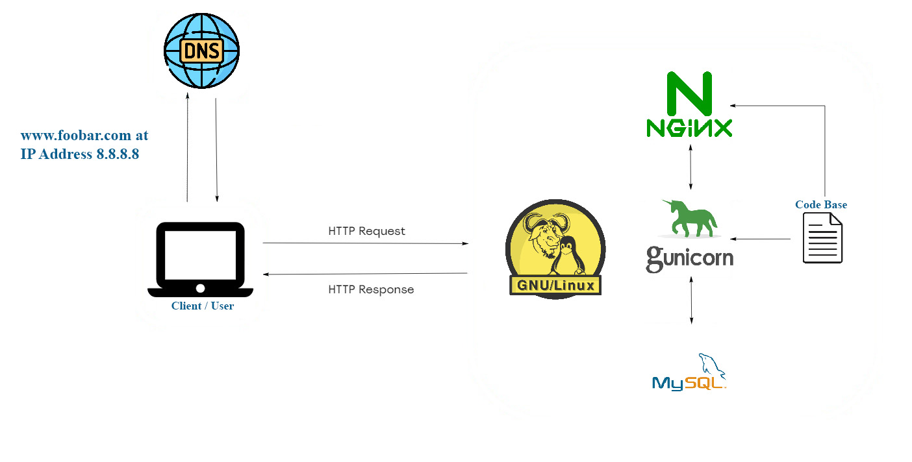

# Simple Web Stack

## Description

This represents a basic web infrastructure hosting a website accessible via www.foobar.com. Notably, there are no firewalls or SSL certificates in place to secure the server's network. Additionally, all components, including the database and application server, share the server's resources such as CPU, RAM, and SSD.

## Specifics About This Infrastructure

+ What a server is. A server is either computer hardware or software that furnishes services to other computers, commonly referred to as clients.

+ The role of the domain name. The domain name serves as a user-friendly alias for an IP Address. For instance, www.wikipedia.org is easier to recognize and remember than 91.198.174.192. This IP address and domain name mapping is accomplished through the Domain Name System (DNS).

+ The type of DNS record www is in www.foobar.com. www.foobar.com utilizes an A record. You can verify this by executing dig www.foobar.com. It's important to note that the results may vary, but for this infrastructure design, an A record is employed. 
<i>An Address Mapping record (A Record), also known as a DNS host record, stores a hostname and its corresponding IPv4 address.</i>

+ The role of the web server. The web server, whether software or hardware, receives requests via HTTP or secure HTTP (HTTPS) and delivers the content of the requested resource or an error message in response.

+ The role of the application server. The application server is responsible for installing, operating, and hosting applications and associated services for end users, IT services, and organizations. It facilitates the hosting and delivery of high-end consumer or business applications.

+ The role of the database. The database's role is to maintain an organized collection of information that can be easily accessed, managed, and updated.

+ What the server uses to communicate with the client (user's computer requesting the website). Communication between the server and the client takes place over the internet network through the TCP/IP protocol suite.

## Issues With This Infrastructure

+ Multiple SPOFs (Single Points Of Failure) exist in this infrastructure. For example, if the MySQL database server experiences downtime, the entire site becomes inaccessible.

+ Downtime is incurred during maintenance requirements. When maintenance tasks need to be performed on any component, they must either be taken offline or the entire server must be shut down. Since there's only one server, this results in website downtime.

+ Scaling is challenging in the face of high incoming traffic. Scaling this infrastructure is problematic because all the required components reside on a single server. As a result, the server can quickly exhaust its resources or slow down when subjected to a high volume of requests.
