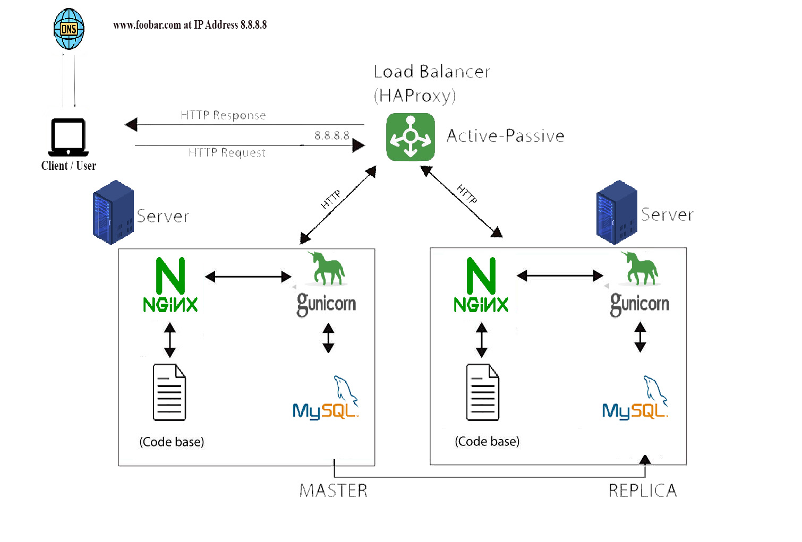

# Distributed Web Infrastructure

## Description

This is a distributed web infrastructure designed to reduce traffic to the primary server by distributing some of the load to a replica server with the assistance of a load balancer responsible for load distribution between the two servers (primary and replica).

## Specifics About This Infrastructure

+ Load Balancer Algorithm:
The HAProxy load balancer is configured with the Round Robin distribution algorithm. This algorithm cycles through each server behind the load balancer in a sequential manner based on their assigned weights. It ensures that processing time is evenly distributed among the servers, making it one of the fairest algorithms. Additionally, Round Robin is a dynamic algorithm that allows for real-time adjustments to server weights.
+ Load Balancer Setup:
The HAProxy load balancer enables an Active-Passive setup, as opposed to an Active-Active setup. In Active-Active, workloads are distributed across all nodes to prevent overloading of any single node, resulting in improved throughput and response times. In Active-Passive, not all nodes are active at the same time. For instance, in a two-node setup, if the first node is active, the second node remains passive or on standby. The next passive node becomes active only if the preceding node becomes inactive.
+ Database Primary-Replica (Master-Slave) Cluster:
A Primary-Replica setup designates one server as the Primary server and the other as a Replica of the Primary. The Primary server handles both read and write requests, while the Replica server is limited to read requests. Data synchronization occurs whenever the Primary server executes a write operation.
+ Difference Between Primary and Replica Nodes:

The Primary node is responsible for all write operations required by the site, while the Replica node primarily processes read operations. This setup reduces the read traffic directed to the Primary node, improving its performance.
## Issues With This Infrastructure

+ Multiple Single Points of Failure (SPOF):
There are several potential SPOFs in this infrastructure. For instance, if the Primary MySQL database server experiences downtime, the entire site would be unable to perform changes (e.g., adding or removing users). Additionally, the server hosting the load balancer and the application server connecting to the primary database server are also single points of failure.
+ Security Concerns:
Data transmitted over the network lacks encryption using an SSL certificate, leaving it susceptible to interception by malicious actors. Furthermore, the absence of a firewall on any server prevents the blocking of unauthorized IPs, posing a security risk.
+ Lack of Monitoring:
There is currently no monitoring system in place to assess the status of each server. Monitoring is essential for promptly identifying and addressing issues and ensuring the overall health and performance of the infrastructure.
